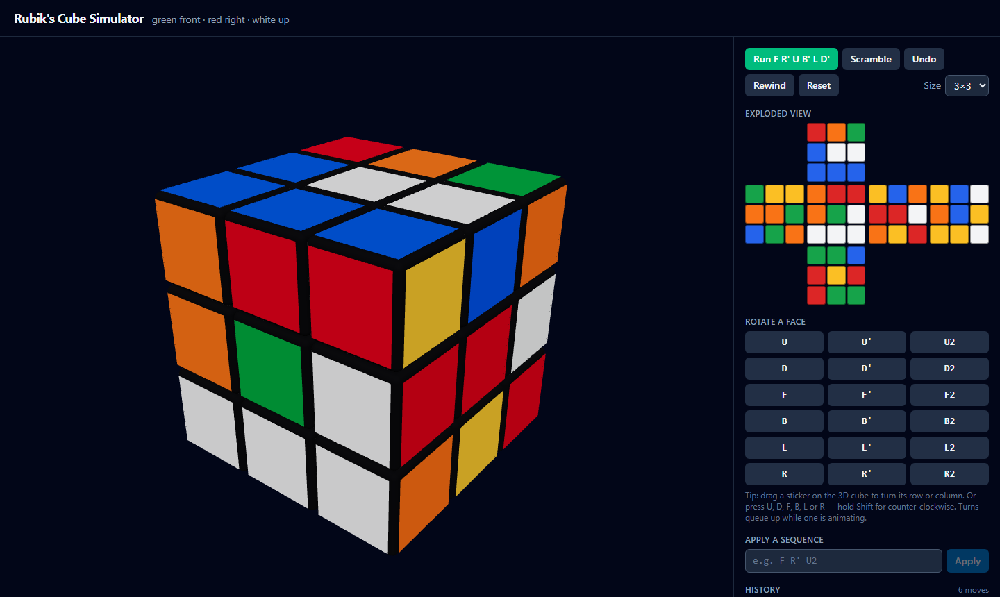

# Rubik's Cube Simulator

[](https://github.com/IvanZhelyazkovv/rubiks-cube-simulator/actions/workflows/ci.yml)

A programmatic Rubik's cube that can correctly rotate any face — a pure .NET domain
model behind a console runner, a REST API and an interactive 3D web UI. Supports cube
sizes from 2×2 to 10×10 (3×3 by default). The cube starts solved and oriented as on
[rubiks-cube-solver.com](https://rubiks-cube-solver.com/): **green at the front, red
on the right, white on top**.

> **Scope note:** the domain model and the console runner alone satisfy the task —
> they are the part to review first. The REST API and the web UI are an optional
> showcase built on the same domain.

## Prerequisites

| Tool | Needed for | Notes |
|---|---|---|
| [.NET 10 SDK](https://dotnet.microsoft.com/download/dotnet/10.0) | everything | free; Windows, Linux or macOS |
| [Node.js 20+](https://nodejs.org/) | the web UI only | free; not needed for the console app or tests |

## Quick start — the console app

```bash
dotnet run --project src/RubiksCube.Cli
```

This prints the solved cube, applies the verification sequence
**F R' U B' L D'** (front clockwise, right anti-clockwise, up clockwise, back
anti-clockwise, left clockwise, down anti-clockwise) and prints the resulting
exploded view:

```
       R O G
       B W W
       B B B
G Y Y  O R R  Y B O  Y B W
O O G  O G W  R R W  O B Y
B G O  W W W  O Y R  Y Y W
       G G B
       R Y R
       R G G
```

Letters are the sticker colours (White, Yellow, Green, Blue, Red, Orange), shown
in colour on an interactive terminal. Any custom sequence and cube size work too:

```bash
dotnet run --project src/RubiksCube.Cli -- "R U R' U'" --size 4
```

## Tests

```bash
dotnet test
```

The suite covers every face rotation with hand-derived expected states, algebraic
properties (four quarter turns restore the cube, a move followed by its inverse
restores the cube, scramble-and-undo round trips) across cube sizes 2–5, the
notation parser, the REST API end to end, and the task's verification sequence
sticker by sticker
([TaskScenarioTests](tests/RubiksCube.Tests/Application/TaskScenarioTests.cs) —
the expectation is transcribed from the task sheet, independent of this code).
The web app has its own suite:

```bash
cd apps/web
npm ci
npm run test
```

End-to-end tests drive the real stack — the API serving the built UI in a real
browser, 3D view included — through Playwright, on desktop and phone viewports:

```bash
cd apps/web && npm ci && npm run build     # the E2E suite drives the built UI
cd ../e2e && npm ci && npx playwright install chromium
npx playwright test                        # Playwright starts the API itself
```

## The web UI



An interactive 3D cube with animated face turns: **drag a sticker to turn its
layer**, drag the background to orbit. Alongside it: the exploded view, a move
pad for all eighteen face turns, keyboard control (U D F B L R, Shift for
counter-clockwise — turns queue while one animates), free-text sequences, undo,
a rewind that replays the inverse of the whole history back to solved, scramble,
reset and cube sizes from 2×2 to 5×5 — plus a button that runs the task's
verification sequence move by move.

```bash
# 1. Build the UI into the API's wwwroot (first time only, or after UI changes)
cd apps/web
npm ci
npm run build

# 2. Serve API + UI together
cd ../..
dotnet run --project src/RubiksCube.Api
```

Then open **http://localhost:5180**. Interactive API documentation (Swagger) is
at http://localhost:5180/swagger.

For UI development with hot reload, run the API and `npm run dev` side by side —
Vite proxies API calls to port 5180.

## How it works

The short version: rotations are computed geometrically rather than through
hand-written sticker permutation tables. Every sticker maps to an exact integer
position and face normal in cube space; turning a face is a 90° integer rotation
of its outer layer; the spatial convention lives in one six-row table that can be
checked against the exploded view. That is what makes any cube size work through
a single code path — and what 300+ automated tests pin down from several
independent directions. The web client's types are generated from the API's
OpenAPI document, with a CI gate that fails on contract drift.

The long version, including the layering and the reasoning behind the design
decisions, is in **[ARCHITECTURE.md](ARCHITECTURE.md)**.

## Solution layout

```
src/
  RubiksCube.Domain/        The cube model — immutable, no external dependencies
  RubiksCube.Application/   Sessions, use cases, ports, DTOs, net rendering
  RubiksCube.Api/           ASP.NET Core REST API; serves the built web UI
  RubiksCube.Cli/           Console runner printing the exploded view
apps/
  web/                      React + TypeScript + three.js web UI
tests/
  RubiksCube.Tests/         xUnit suite (domain, application, CLI, API)
```
